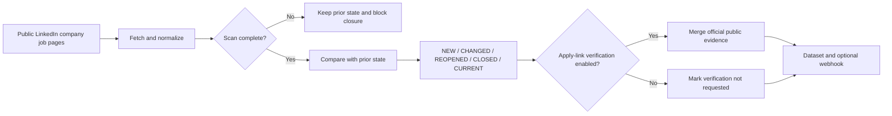

> **Live API:** [Run LinkedIn Hiring Signals on Apify](https://apify.com/kamerozkan/linkedin-hiring-signals)

# LinkedIn Hiring Signals: Sample Inputs and Event Schema

[](https://apify.com/kamerozkan/linkedin-hiring-signals)


Monitor public LinkedIn company job pages and emit typed records for new, changed, reopened, closed, and current postings. The Actor is stateful, so it can compare complete scans instead of treating every run as an isolated scrape.

This repository contains runnable inputs, privacy-minimized output samples, and the exact record contract in [`dataset_record.schema.json`](dataset_record.schema.json).

## Start here

1. Open the [Actor on Apify](https://apify.com/kamerozkan/linkedin-hiring-signals).
2. Copy one of the input samples below.
3. Run it once to establish state.
4. Schedule later runs with the same task and state namespace to receive lifecycle changes.

The Apify Store exposed **one public Example Task** when this repository was audited on 2026-07-28. Input 01 is that public example. Inputs 02 and 03 mirror existing private task configurations whose task run counts were zero at audit time. They are runnable configurations, not evidence of observed results.

## Input examples

<details>
<summary><strong>01. Verified company signals</strong> - public Store Example Task</summary>

[`01_verified_company_signals.json`](01_verified_company_signals.json)

```json
{
  "companies": [
    "https://www.linkedin.com/company/tiny-spec-inc/"
  ],
  "maxJobsPerCompany": 100,
  "closureConfirmationScans": 2,
  "emitInitialSnapshot": true,
  "emitCurrentSnapshot": true,
  "stateNamespace": "example-verified-company-signals-v0211",
  "strictClosureQualityGate": true,
  "verifyApplyLinks": true,
  "strictVerificationQualityGate": true,
  "maxJobsToVerify": 20,
  "verificationMaxTotalChargeUsd": 0.1,
  "maxConcurrency": 1,
  "proxyConfiguration": {
    "useApifyProxy": true
  }
}
```

</details>

<details>
<summary><strong>02. Multi-company change feed</strong> - existing private task configuration</summary>

[`02_multi_company_change_feed.json`](02_multi_company_change_feed.json)

```json
{
  "companies": [
    "https://www.linkedin.com/company/github/",
    "https://www.linkedin.com/company/gitlab-com/",
    "https://www.linkedin.com/company/cloudflare/",
    "https://www.linkedin.com/company/datadog/",
    "https://www.linkedin.com/company/mongodbinc/",
    "https://www.linkedin.com/company/elastic-co/",
    "https://www.linkedin.com/company/atlassian/",
    "https://www.linkedin.com/company/hubspot/"
  ],
  "maxJobsPerCompany": 1000,
  "closureConfirmationScans": 2,
  "emitInitialSnapshot": false,
  "emitCurrentSnapshot": false,
  "stateStoreName": "linkedin-hiring-signals-canary",
  "stateNamespace": "auto",
  "strictClosureQualityGate": true,
  "verifyApplyLinks": false,
  "maxConcurrency": 3,
  "proxyConfiguration": {
    "useApifyProxy": true
  },
  "closedJobRetentionDays": 90,
  "strictVerificationQualityGate": true,
  "verifierActorId": "kamerozkan/linkedin-job-apply-link-verifier",
  "maxJobsToVerify": 500,
  "verificationMaxTotalChargeUsd": 2,
  "webhookBatchSize": 100
}
```

</details>

<details>
<summary><strong>03. SaaS hiring watchlist</strong> - existing private task configuration</summary>

[`03_saas_hiring_watchlist.json`](03_saas_hiring_watchlist.json)

```json
{
  "companies": [
    "https://www.linkedin.com/company/hubspot/",
    "https://www.linkedin.com/company/dropbox/",
    "https://www.linkedin.com/company/notionhq/",
    "https://www.linkedin.com/company/figma/"
  ],
  "maxJobsPerCompany": 1000,
  "closureConfirmationScans": 2,
  "emitInitialSnapshot": false,
  "emitCurrentSnapshot": false,
  "stateStoreName": "linkedin-hiring-signals-canary",
  "stateNamespace": "auto",
  "strictClosureQualityGate": true,
  "verifyApplyLinks": false,
  "maxConcurrency": 3,
  "proxyConfiguration": {
    "useApifyProxy": true
  },
  "closedJobRetentionDays": 90,
  "strictVerificationQualityGate": true,
  "verifierActorId": "kamerozkan/linkedin-job-apply-link-verifier",
  "maxJobsToVerify": 500,
  "verificationMaxTotalChargeUsd": 2,
  "webhookBatchSize": 100
}
```

</details>

## Output examples

The first record is a redacted excerpt from a successful live Actor dataset. The changed and closed records are clearly labeled deterministic lifecycle replays. They demonstrate the schema and tested state transition semantics, but they are not claims that those events were observed in the public Store run. See [`DATA_NOTICE.md`](DATA_NOTICE.md) for provenance and redactions.

<details>
<summary><strong>01. Live NEW event with an official apply match</strong></summary>

[`01_live_new_official_apply.json`](01_live_new_official_apply.json)

```json
{
  "jobId": "redacted-live-job-01",
  "title": "Senior Director, Product Management, Slackforce",
  "companyId": "1612748",
  "companyName": "Slack",
  "companyUrl": "https://www.linkedin.com/company/tiny-spec-inc",
  "location": "San Francisco, CA",
  "jobUrl": "https://example.com/redacted/linkedin-job/live-01",
  "postedAt": "2026-07-09",
  "jobTitle": "Senior Director, Product Management, Slackforce",
  "eventType": "new",
  "detectedAt": "2026-07-28T15:00:48.497Z",
  "firstSeenAt": "2026-07-28T15:00:48.497Z",
  "lastSeenAt": "2026-07-28T15:00:48.497Z",
  "changedFields": [],
  "source": "linkedin_public_jobs",
  "verificationStatus": "completed",
  "officialApplyUrl": "https://example.com/redacted/official-apply/live-01",
  "applyMethod": "OFFSITE",
  "jobStatus": "ACTIVE",
  "safeToPublish": true,
  "reviewRequired": false,
  "verificationConfidence": 0.9667,
  "sourceProvider": "workday",
  "companyWebsite": "https://slack.com/",
  "verifiedAt": "2026-07-28T15:00:53.832740+00:00",
  "verificationEvidence": [
    "linkedin_about_website_direct",
    "linkedin_description_loaded",
    "linkedin_apply_method:OFFSITE",
    "verified_company_website_map",
    "ats_link_on_career_page",
    "official_site_to_career_source_verified",
    "generic_board_resolved_to_exact_job",
    "workday_cxs_api:query=senior director product management slackforce",
    "inventory_jobs:1",
    "best_official_title:Senior Director, Product Management, Slackforce",
    "conservative_official_inventory_match"
  ],
  "ghostJobRisk": "low"
}
```

</details>

<details>
<summary><strong>02. Deterministic CHANGED replay</strong> - location changed</summary>

[`02_replay_changed_location.json`](02_replay_changed_location.json)

```json
{
  "jobId": "redacted-replay-job-9001",
  "title": "Backend Engineer",
  "companyId": "redacted-replay-company-12345",
  "companyName": "Example Systems",
  "companyUrl": "https://example.com/redacted/linkedin-company/example-systems",
  "location": "Munich, Germany",
  "jobUrl": "https://example.com/redacted/linkedin-job/replay-9001",
  "postedAt": "2026-07-20",
  "jobTitle": "Backend Engineer",
  "eventType": "changed",
  "detectedAt": "2026-07-27T10:00:00.000Z",
  "firstSeenAt": "2026-07-26T10:00:00.000Z",
  "lastSeenAt": "2026-07-27T10:00:00.000Z",
  "changedFields": [
    "location"
  ],
  "source": "linkedin_public_jobs",
  "verificationStatus": "not_requested",
  "officialApplyUrl": null,
  "applyMethod": null,
  "jobStatus": null,
  "safeToPublish": null,
  "reviewRequired": null,
  "verificationConfidence": null,
  "sourceProvider": null,
  "companyWebsite": null,
  "verifiedAt": null,
  "verificationEvidence": [],
  "ghostJobRisk": "unknown"
}
```

</details>

<details>
<summary><strong>03. Deterministic CLOSED replay</strong> - after two complete absence scans</summary>

[`03_replay_closed_confirmed.json`](03_replay_closed_confirmed.json)

```json
{
  "jobId": "redacted-replay-job-9001",
  "title": "Backend Engineer",
  "companyId": "redacted-replay-company-12345",
  "companyName": "Example Systems",
  "companyUrl": "https://example.com/redacted/linkedin-company/example-systems",
  "location": "Munich, Germany",
  "jobUrl": "https://example.com/redacted/linkedin-job/replay-9001",
  "postedAt": "2026-07-20",
  "jobTitle": "Backend Engineer",
  "eventType": "closed",
  "detectedAt": "2026-07-29T10:00:00.000Z",
  "firstSeenAt": "2026-07-26T10:00:00.000Z",
  "lastSeenAt": "2026-07-27T10:00:00.000Z",
  "changedFields": [],
  "source": "linkedin_public_jobs",
  "verificationStatus": "not_applicable",
  "officialApplyUrl": null,
  "applyMethod": null,
  "jobStatus": null,
  "safeToPublish": null,
  "reviewRequired": null,
  "verificationConfidence": null,
  "sourceProvider": null,
  "companyWebsite": null,
  "verifiedAt": null,
  "verificationEvidence": [],
  "ghostJobRisk": "unknown"
}
```

</details>

## Consumer decision guide

| Record condition | Suggested consumer action | Important boundary |
|---|---|---|
| `verificationStatus = completed`, `jobStatus = ACTIVE`, `safeToPublish = true` | Prefer the non-null `officialApplyUrl` | Verification reflects the observed public evidence at `verifiedAt`, not a permanent guarantee |
| `verificationStatus = completed`, `jobStatus = EXPIRED` or `safeToPublish = false` | Suppress from active-job delivery | Do not substitute a guessed apply URL |
| `verificationStatus = skipped_limit` | Treat verification fields as unknown or rerun with a larger verification cap | A skipped record is not evidence that a job is active or expired |
| `eventType = changed` | Read `changedFields` before triggering downstream workflows | A changed posting is not necessarily a new opening |
| `eventType = closed` | Remove from active-job workflows if the closure policy fits your use case | Closure means absence after configured complete scans, not proof the role was filled or cancelled |
| `ghostJobRisk = high` | Review or suppress according to your policy | This is a public-evidence heuristic, not proof of employer intent |

## Why stateful monitoring matters

| Failure mode | One-off scrape | This Actor's documented behavior |
|---|---|---|
| Temporary partial response | Missing jobs can look closed | Incomplete scans do not advance closure state |
| Job lifecycle | Rebuild the diff yourself | Emits `new`, `changed`, `reopened`, `closed`, and optional `current` records |
| Output consistency | Ad hoc fields | Records follow a strict JSON Schema |
| Apply-link checks | LinkedIn URL only | Optional verifier can resolve employer-owned or ATS evidence |
| Delivery | Manual polling | Dataset output plus optional batched webhook delivery |



## Data contract

Every dataset row must match [`dataset_record.schema.json`](dataset_record.schema.json). Key fields:

- `eventType`: lifecycle event emitted by state comparison.
- `firstSeenAt` and `lastSeenAt`: observation timestamps for the stored posting.
- `changedFields`: normalized fields that changed since the previous complete observation.
- `verificationStatus`: whether optional apply-link verification ran and produced a result.
- `safeToPublish`: nullable verifier decision. `null` means no decision was available.
- `ghostJobRisk`: conservative heuristic from public status and evidence.

## Honest limits

- This project is not affiliated with or endorsed by LinkedIn.
- It uses public company job pages, not profiles, applications, resumes, candidate data, or recruiter contact data.
- Polling cadence determines freshness. This is not a guaranteed real-time feed.
- Public endpoints can change, throttle, return partial data, or become unavailable.
- A complete scan is required before absence can contribute to closure confirmation.
- `closed` does not prove why an employer removed a posting.
- `ghostJobRisk` does not prove that a job is fake or reveal employer intent.
- Current build tag `0.2.24` built successfully on 2026-07-28, but the sample dataset below came from successful build `0.2.19`. These samples do not claim to validate runtime behavior of `0.2.24`.
- No uptime or completeness SLA is claimed by this sample repository.

## Verified snapshot

At the 2026-07-28 audit:

- Current Actor tag: `0.2.24`, build status `SUCCEEDED`.
- Most recent successful Actor run: build `0.2.19`; it scanned 391 jobs and emitted zero lifecycle events, which is a valid stateful outcome.
- Latest successful non-empty dataset used for output 01: build `0.2.19`, 25 `new` records.
- Latest successful public Example Task run: build `0.2.13`, 25 records.
- Outputs 02 and 03 are deterministic replays based on tested state transitions and are not live Store observations.

See [`DATA_NOTICE.md`](DATA_NOTICE.md) for IDs, redaction details, and interpretation rules.

## License

Code and documentation in this sample repository are available under the [MIT License](LICENSE). Source data and third-party names remain subject to their respective rights and terms.
